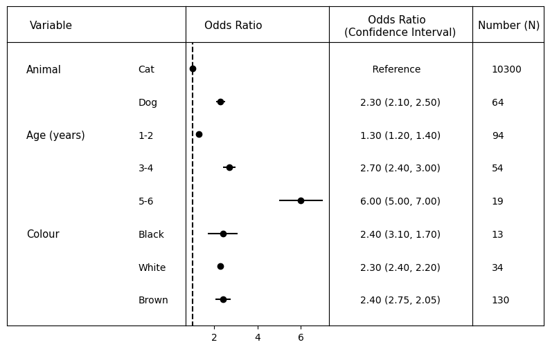

# Example code for using reg-vis


```python
import sys
sys.path.append('..')
import reg_vis

# Initiate plotting class
reg_vis = reg_vis.reg_plot()

# Load data
reg_vis.load_data("example_data.xlsx")
```

You can equally load the data into a pandas dataframe yourself and then use `reg_vis.df = data`.


```python
# Choose font sizes
reg_vis.font_size = 10
reg_vis.group_size = 10.5
reg_vis.header_size = 11

# Plot regression data
reg_vis.plot()

# Save visualisation
reg_vis.save_plot("example_plot.png")
```


    

    

