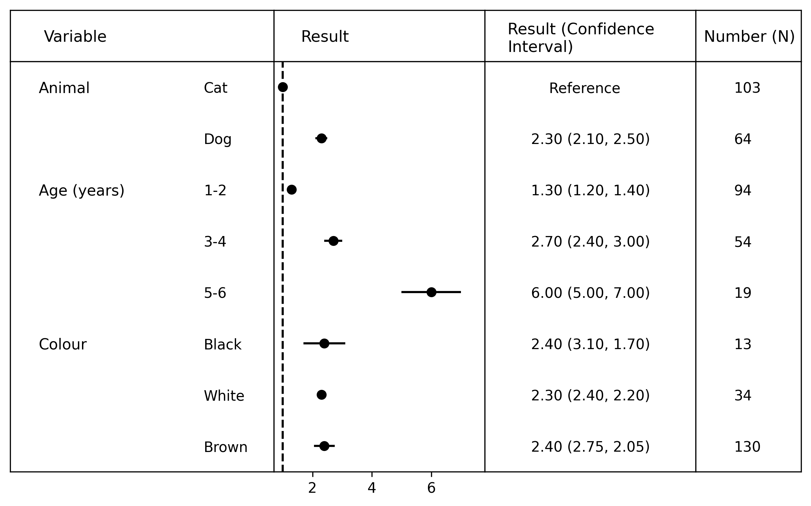
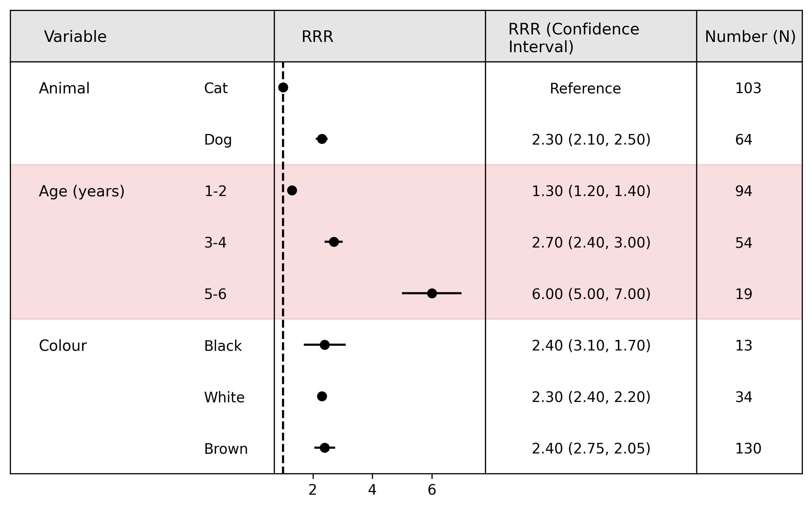

# Example code for using reg-vis

## Loading data


```python
import sys
sys.path.append('..')
import reg_vis

# Initiate plotting class
reg_vis = reg_vis.reg_plot()

# Load data
reg_vis.load_data("example_data.xlsx")
```

You can equally load the data into a pandas dataframe yourself and then use `reg_vis.df = data`.

## Basic plotting


```python
# Choose font sizes
reg_vis.font_size = 10
reg_vis.group_size = 10.5
reg_vis.header_size = 11

# Plot regression data
reg_vis.plot()

# Save visualisation
reg_vis.save_plot("example_plot1.png")
```


    

    


## Variable counts

You can also include the number of cases for each variable by setting `counts = True` in the `.plot()` function.


```python
# Choose font sizes
reg_vis.font_size = 10
reg_vis.group_size = 10.5
reg_vis.header_size = 11

# Plot regression data
reg_vis.plot(counts = True)

# Save visualisation
reg_vis.save_plot("example_plot2.png")
```


    

    


## Adding colour

We can also add background colour to the column headers and the different variable groups as follows


```python
reg_vis.plot(counts = True, 
             group1_color = None,
             group2_color = "tab:red",
             group_alpha = 0.15,
             head_fill = "gray")

reg_vis.save_plot("example_plot3.png")
```


    

    

